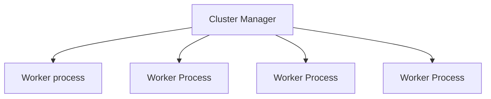
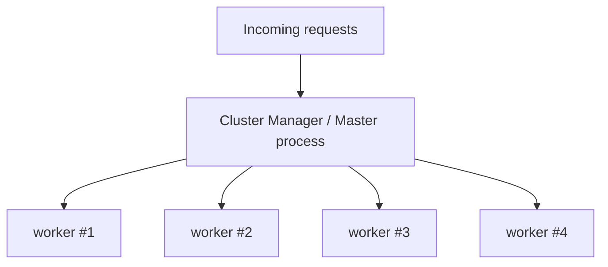

# Node JS Cluster Module (Draft)

As we know Node JS is single threaded. So to take advantage of multi-threaded/multi-core  processors, we'll use cluster module. 

According to Node JS docs 

> A single instance of Node.js runs in a single thread. To take advantage of multi-core systems, the user will sometimes want to launch a cluster of Node.js processes to handle the load. The cluster module allows easy creation of child processes that all share server ports.

In a nutshell with the help of cluster module, we can spin up multiple instances of a node js process  which are called workers processes



The cluster manager is the parent process, which manages the worker processes. The cluster manager is responsible for managing these instances. It doesn't execute any application code and isn't responsible for handling network requests.

## Using Cluster Module

Let's create a folder named `cluster-example`.

Open it insider your terminal and run the following commands

```bash
$ npm init -y
```

It creates the `package.json` file.

Now install express using

```bash
$ npm install express
```

#### Without Cluster Module

Let create two files, First one `without-cluster.js` which doesn't use cluster module.

```javascript
//without-cluster.js

const express = require('express');
const app = express();
const port = 5000;

//Calculate Fibonacci Number
function fib(n) {
  if (n < 2) {
    return n;
  }
  return fib(n - 1) + fib(n - 2);
}

app.get('/', (req, res) => {
  const result = fib(30);
  return res.send({ data: result });
});

app.listen(port, () => console.log(`App listening on port ${port}!`));
```

If you look at the above code, it's simple express app which calculates the Fibonacci number and sends the result. To keep this post simple I'm not going to explain about Fibonacci number.

#### With cluster Module

Let create another file named `with-cluster.js` which uses cluster module.

```javascript
//with-cluster.js

const cluster = require("cluster");
const express = require("express");
const app = express();
const port = 5000;

//To check whether it's a cluster manager(Master Process)
if (cluster.isMaster) {
    //This method creates the worker processes
    cluster.fork();
    cluster.fork();
    cluster.fork();
    cluster.fork();  //Here we created four worker processes
} else {
    function fib(n) {
        if (n < 2) {
            return n;
        }

        return fib(n - 1) + fib(n - 2);
    }

    app.get("/", (req, res) => {
        const result = fib(30);
        return res.send({ data: result });
    });

    app.listen(port, () =>
        console.log(`App listening on port ${port} ${process.pid}!`)
    );
}
```

If you look at the above code, it's the  same app which calculates the Fibonacci number but uses cluster module. We're just wrapping out code inside a `if else` block.

So when we run `node with-cluster.j`


`s` , 



### Notes

* Cluster manager isn’t responsible for handling network requests
* Cluster manager doesn’t execute code
* Cluster manager is responsible for managing the instances